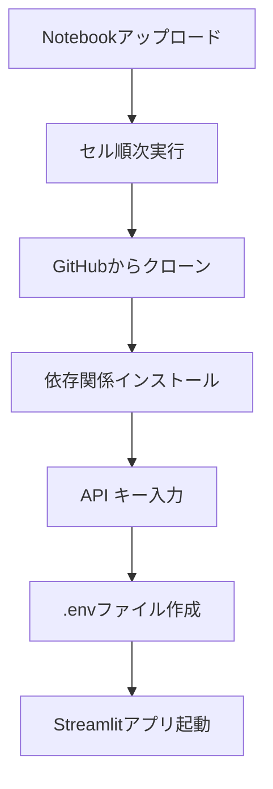

# 🚀 AI Tutor Streamlit App - Deepnote セットアップガイド

このプロジェクトをDeepnoteで実行するための完全ガイドです。

## 📋 クイックスタート

### 1. Notebookの取得
- `deepnote_setup.ipynb` をDeepnoteにアップロード
- または、GitHubから直接インポート

### 2. セットアップ実行
1. Notebookを開く
2. 上から順番にセルを実行
3. 環境変数設定セルで **GEMINI_API_KEY** を入力
4. 最後のセルでStreamlitアプリが起動

## 🔑 API キーの準備

以下のAPIキーが必要です：
```
GEMINI_API_KEY="your_api_key_here"
```

## 📦 環境構築方式

### ✅ 採用方式：requirements.txt + .env
- **理由**: Deepnoteでの確実な動作を優先
- **メリット**: 
  - 安定した依存関係管理
  - .envファイルでセキュアな環境変数管理
  - 幅広い環境での互換性

### 🔄 ローカル開発との互換性
- **ローカル**: `uv sync` で高速インストール
- **Deepnote**: `pip install -r requirements.txt` で確実インストール
- **共通**: `.env` ファイルで環境変数管理

## 🎯 実行フロー



## 🔄 2回目以降の使用

高速更新機能を使用：
1. 高速更新セルのコメントアウトを外す
2. セルを実行
3. 最新のコードが自動取得される

## 🛠️ トラブルシューティング

### よくある問題と解決方法

| 問題 | 解決方法 |
|------|----------|
| API キーエラー | 環境変数設定セルを再実行 |
| 依存関係エラー | 完全セットアップを再実行 |
| .envファイルエラー | 手動で.envファイルを作成 |
| クローンエラー | プロジェクトディレクトリを削除して再実行 |

### 手動 .env ファイル作成

もしNotebookでの自動作成が失敗した場合：

1. プロジェクトディレクトリで新しいファイルを作成
2. ファイル名を `.env` に設定
3. 以下の内容を記述：
```
GEMINI_API_KEY="your_api_key_here"
```

## 📁 プロジェクト構造

```
/work/ai-tutor-app/
├── app.py                 # メインアプリケーション
├── .env                   # 環境変数（自動生成）
├── requirements.txt       # 依存関係
├── config.yaml           # 設定ファイル
├── prompts/              # プロンプトテンプレート
├── core/                 # コアロジック
├── services/             # サービス層
├── ui/                   # UI コンポーネント
└── utils/                # ユーティリティ
```

## 🔒 セキュリティ

- ✅ `.env` ファイルは `.gitignore` に含まれています
- ✅ API キーはGitHubにコミットされません
- ✅ Deepnoteのプライベート環境で安全に実行されます

## 🚀 パフォーマンス

- **初回セットアップ**: 約2-3分
- **高速更新**: 約30秒
- **アプリ起動**: 約10-15秒

---

## 📞 サポート

問題が発生した場合は、以下を確認してください：
1. GEMINI_API_KEYが正しく設定されているか
2. インターネット接続が安定しているか
3. Deepnoteの実行環境に問題がないか

それでも解決しない場合は、プロジェクトディレクトリを削除して完全セットアップを再実行してください。 